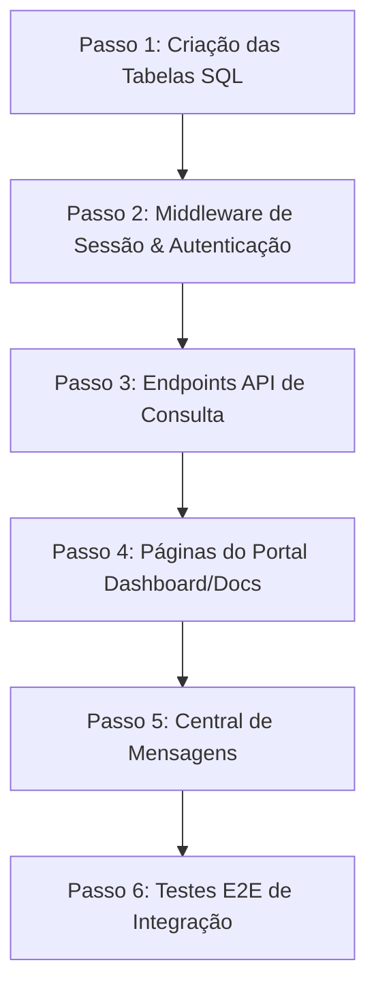

# LIMA Solutions ERP – Arquitetura do Portal do Cliente (Fase 1)

> **Documento de Arquitetura e Planejamento Técnico**  
> **Versão**: 1.0  
> **Estado**: Em Revisão (Aguardando Aprovação)  

Este documento descreve a especificação técnica e a arquitetura para a **Fase 1 do Portal do Cliente**, cujo objetivo é permitir que os clientes da **Lima Déménagement** acompanhem seus serviços (projetos, orçamentos, faturas, recibos e comunicação) de forma autônoma e segura, sem depender do painel administrativo.

---

## 1. Diretrizes de Design & Reutilização

Para manter o ERP enxuto, seguro e fácil de manter, adotamos os seguintes princípios:
1. **Não Duplicação**: Reutilizar toda a infraestrutura base do ERP (conexão PDO, tratamento de erros, cabeçalhos CSP, helper financeiro `FinanceHelper.php` e gerador de PDF `PdfTemplate.php`).
2. **Isolamento Estrito**: Garantir que as sessões do Portal do Cliente estejam completamente separadas das sessões administrativas do painel administrativo, impossibilitando que clientes acessem APIs internas administrativas ou vice-versa.
3. **Multi-empresa (company_id)**: O Portal do Cliente herda o isolamento estrito de empresas. O login e dados de cada cliente são escopados sob o `company_id` correspondente.

---

## 2. Estrutura de Diretórios Proposta

O código do Portal do Cliente ficará isolado em pastas dedicadas, facilitando o controle de acessos no servidor:

```text
public_site/
│
├── portal/                         ← Interface Web do Cliente (Frontend)
│   ├── auth.php                    ← Middleware de sessão do cliente
│   ├── login.php                   ← Tela de Login do cliente
│   ├── forgot_password.php         ← Solicitação de recuperação de senha
│   ├── reset_password.php          ← Tela de alteração de senha segura
│   │
│   ├── index.php                   ← Dashboard do Cliente (KPIs, Projetos ativos)
│   ├── quotes.php                  ← Listagem e visualização de Orçamentos (Devis)
│   ├── invoices.php                ← Histórico de Faturas e Pagamentos
│   ├── messages.php                ← Central de Mensagens cliente ↔ equipe
│   └── logout.php                  ← Terminar sessão do cliente
│
└── api/v1/portal/                  ← Endpoints de API Exclusivos do Cliente
    ├── auth.php                    ← API para login e reset de senha
    ├── quotes.php                  ← API para carregar orçamentos e aceitar/rejeitar
    ├── invoices.php                ← API para carregar faturas e pagamentos
    └── messages.php                ← API para carregar e enviar mensagens
```

---

## 3. Modelo de Banco de Dados (Novas Tabelas)

Para suportar credenciais próprias, comunicação e auditoria do cliente, propomos a criação de **duas novas tabelas** no banco de dados `lima_solutions`.

### Tabela 1: `client_users` (Usuários do Portal do Cliente)
Esta tabela separa a entidade comercial (`clients`) do cadastro de login. Um cliente (`client_id`) pode possuir uma ou mais contas de usuário associadas.

```sql
CREATE TABLE IF NOT EXISTS `client_users` (
  `id` INT AUTO_INCREMENT PRIMARY KEY,
  `company_id` INT NOT NULL,
  `client_id` INT NOT NULL,
  `name` VARCHAR(150) NOT NULL,
  `email` VARCHAR(150) NOT NULL,
  `password_hash` VARCHAR(255) NOT NULL,
  `password_reset_token` VARCHAR(100) DEFAULT NULL,
  `password_reset_expires` DATETIME DEFAULT NULL,
  `active` TINYINT(1) DEFAULT 1,
  `last_login` DATETIME DEFAULT NULL,
  `created_at` TIMESTAMP DEFAULT CURRENT_TIMESTAMP,
  `updated_at` TIMESTAMP DEFAULT CURRENT_TIMESTAMP ON UPDATE CURRENT_TIMESTAMP,
  UNIQUE KEY `idx_client_user_email` (`company_id`, `email`),
  FOREIGN KEY (`company_id`) REFERENCES `companies` (`id`) ON DELETE CASCADE,
  FOREIGN KEY (`client_id`) REFERENCES `clients` (`id`) ON DELETE CASCADE
) ENGINE=InnoDB DEFAULT CHARSET=utf8mb4 COLLATE=utf8mb4_unicode_ci;
```

### Tabela 2: `client_messages` (Mensagens entre Cliente e Equipe)
Armazena a comunicação interativa, podendo ser geral ou vinculada a um projeto específico.

```sql
CREATE TABLE IF NOT EXISTS `client_messages` (
  `id` INT AUTO_INCREMENT PRIMARY KEY,
  `company_id` INT NOT NULL,
  `client_id` INT NOT NULL,
  `project_id` INT DEFAULT NULL,
  `sender_type` VARCHAR(20) NOT NULL, -- 'client' ou 'staff'
  `sender_id` INT NOT NULL,           -- ID do client_users ou users correspondente
  `message` TEXT NOT NULL,
  `read_at` DATETIME DEFAULT NULL,
  `created_at` TIMESTAMP DEFAULT CURRENT_TIMESTAMP,
  INDEX `idx_msg_lookup` (`company_id`, `client_id`, `project_id`),
  FOREIGN KEY (`company_id`) REFERENCES `companies` (`id`) ON DELETE CASCADE,
  FOREIGN KEY (`client_id`) REFERENCES `clients` (`id`) ON DELETE CASCADE,
  FOREIGN KEY (`project_id`) REFERENCES `projects` (`id`) ON DELETE SET NULL
) ENGINE=InnoDB DEFAULT CHARSET=utf8mb4 COLLATE=utf8mb4_unicode_ci;
```

---

## 4. Fluxo de Autenticação & Segurança

### Sessão Independente
Para evitar conflitos de privilégios ou escalonamento de privilégios, a sessão do cliente usará chaves específicas prefixadas com `client_`:

* `$_SESSION['client_user_id']`: Identifica o registro ativo em `client_users`.
* `$_SESSION['client_id']`: Identifica o cliente associado comercialmente (`clients`).
* `$_SESSION['client_company_id']`: Identifica a empresa operadora associada.
* `$_SESSION['client_role']`: Sempre `'client'`.
* `$_SESSION['client_csrf_token']`: Token CSRF exclusivo do cliente.

O middleware `portal/auth.php` exigirá a presença de `$_SESSION['client_user_id']`. O painel administrativo `admin/auth.php` exigirá a presença de `$_SESSION['user_id']`. Isso garante que logins do portal de clientes não deem acesso ao painel de administração e vice-versa.

### Recuperação de Senha (Fluxo Idempotente)
1. **Requisição**: Cliente insere o e-mail em `forgot_password.php`.
2. **Token**: O sistema gera um token de uso único em `client_users` (`password_reset_token`) com expiração de 1 hora.
3. **Disparo**: Na Fase 1, simulamos o envio ou exibimos em tela de debug localmente, salvando a url `/portal/reset_password.php?token=...` nos logs para testes. Na Fase 2 (Integração SMTP), o link será disparado por e-mail automaticamente.
4. **Verificação**: A tela de reset valida o token no banco de dados e atualiza a senha de forma segura (Bcrypt).

---

## 5. Especificações dos Endpoints e Visualizações

### 1. Dashboard (`portal/index.php`)
* **Visualização**: Dados cadastrais do cliente, lista de projetos ativos e próximos agendamentos.
* **API de Suporte**: `api/v1/portal/quotes.php` (para aceitar termos) e projetos vinculados.
* **Isolamento de Queries**: Todas as listagens filtram por `client_id = :client_id` e `company_id = :company_id`.

### 2. Documentos & Pagamentos (`portal/quotes.php` e `invoices.php`)
* **Orçamentos**: Visualização do orçamento em formato web. Botões interativos "Aceitar" ou "Recusar" (chamando API para atualizar status da quote e registrar na timeline).
* **Faturas e Recibos**: Exibe faturas emitidas com saldo devedor e histórico de pagamentos recebidos vinculados.
* **Geração de PDF**: O endpoint chama a função existente `renderPdf($id, $companyId)` dos modelos de faturas/orçamentos. O HTML gerado é retornado com o cabeçalho `Content-Type: text/html` ou convertido no navegador.

### 3. Mensagens (`portal/messages.php`)
* **Chat Interativo**: Componente visual de mensagens ordenadas por data.
* **Funcionamento**: A API `api/v1/portal/messages.php` manipula o envio e leitura de dados.
* **Staff Panel**: A equipe administrativa visualizará estas mensagens em uma aba "Mensagens do Cliente" integrada ao perfil do cliente no CRM administrativo (`modules/crm/views/profile.php`), permitindo respostas integradas.

---

## 6. Plano de Implementação Proposto (Passos Sequenciais)



* **Fase de Aprovação**: O código só será iniciado após o aval da arquitetura técnica detalhada acima.
