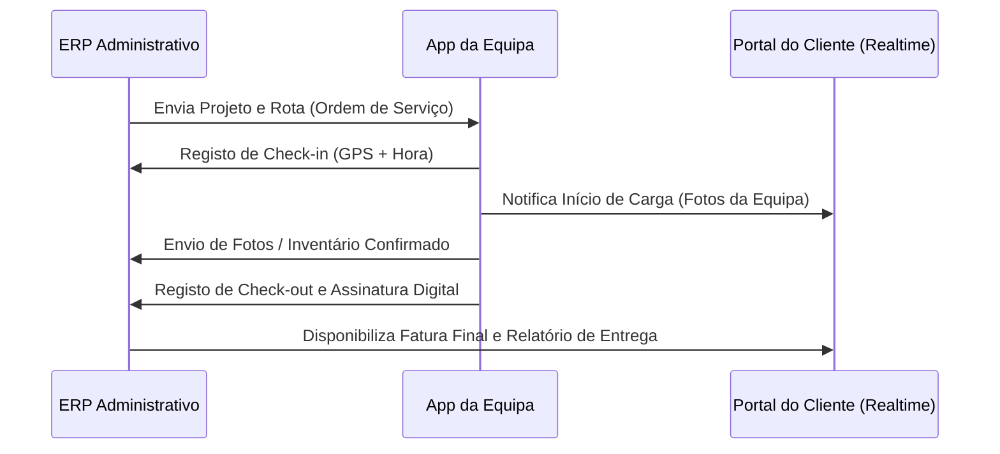

# LIMA Solutions ERP – Roadmap do Ecossistema

> **Documento de Visão Estratégica e Roadmap Tecnológico**  
> **Versão**: 1.0  
> **Data**: 19 de Junho de 2026  
> **Estado**: Planeamento Estratégico (Validado)  
> **Documento de Visão Geral**: [VISION_2030.md](VISION_2030.md)  

Este documento estabelece o planeamento de longo prazo para a evolução do ecossistema **LIMA Solutions ERP**. O objetivo principal é garantir que todos os desenvolvimentos futuros sigam princípios de escalabilidade, modularidade e compatibilidade futura, evitando retrabalho através de uma arquitetura estritamente **API-first**.

---

## 1. Estado Atual (Concluído)

A Fase 1 consolidou a fundação administrativa do ERP e a camada inicial de interação com o cliente final. Os seguintes componentes encontram-se concluídos e operacionais:

```mermaid
graph TD
    subgraph ERP Core [ERP Administrativo]
        DB[Dashboard BI]
        CRM[CRM & Contactos]
        PRJ[Projetos & Kanban]
        TS[Timesheets & Custos]
        ORC[Orçamentos - Devis]
        FAT[Faturas - Factures]
        PAG[Pagamentos & Recibos]
    end

    subgraph Portal Cliente [Portal do Cliente Fase 1]
        PC_AUTH[Autenticação Segura]
        PC_VIEW[Consulta Devis/Factures]
        PC_MSG[Mensagens Cliente <--> Admin]
    end

    ERP Core <-->|Isolamento por company_id| Portal Cliente
```

### Detalhe das Funcionalidades Concluídas
*   **ERP Administrativo**: Painel centralizado de controlo financeiro e operacional com suporte multi-empresa nativo.
*   **CRM**: Ficha completa de clientes e contactos, com histórico financeiro consolidado e análise de saldo devedor.
*   **Projetos**: Quadro Kanban interativo para controlo de tarefas e acompanhamento de etapas da mudança.
*   **Timesheets**: Registo rigoroso de horas de trabalho com workflow de aprovação e congelamento de taxas vigentes (imutabilidade fiscal).
*   **Orçamentos (Devis)**: Criação de propostas detalhadas com taxas de IVA dinâmicas e conversão direta em faturas.
*   **Faturas (Factures) & Pagamentos**: Emissão de faturas, registo de pagamentos totais ou parciais com abatimento automático e geração de recibos em PDF.
*   **Dashboard & BI**: Gráficos operacionais de faturamento, produtividade de equipas e saúde financeira.
*   **Portal do Cliente Fase 1**: Canal seguro e independente para utilizadores finais (clientes) consultarem os seus orçamentos e faturas, com central de mensagens direta bidirecional.
*   **Documentação e UAT**: Guias completos de instalação, deploy, arquitetura de dados e relatório de testes de aceitação (29 cenários de fluxo E2E validados).

---

## 2. Fase 2 (Próxima Prioridade) – Site Institucional & Leads

O foco principal da Fase 2 é a **atração de tráfego e conversão de visitantes em clientes ativos**, fechando o ciclo de venda diretamente no ERP de forma automatizada.

### Objetivo
Transformar visitantes anónimos do website da **Lima Déménagement** em leads qualificadas e, subsequentemente, em clientes com projetos adjudicados.

### Fluxo de Conversão de Leads


### Funcionalidades
1.  **Site Institucional**: Landing page de alta performance, moderna e otimizada para SEO, detalhando os serviços de mudança nacional e internacional.
2.  **Captação de Leads**: Formulário inteligente e interativo para pedido de orçamentos e estimativas (com inserção de inventário de móveis, moradas de origem/destino e datas preferenciais).
3.  **CRM Leads**: Módulo interno dedicado para gerir leads sem poluir o cadastro de clientes faturados.
4.  **Pipeline Comercial**: Funil de vendas Kanban (Novo, Em Análise, Visita Técnica, Proposta Enviada, Ganho, Perdido) para acompanhamento dos orçamentistas.
5.  **Integração Lead ➔ Cliente**: Automação que converte os dados do lead em ficha de cliente com um clique, criando o primeiro rascunho de orçamento.
6.  **E-mails Automáticos**: Disparo de confirmação de receção para o visitante e alertas internos para a equipa comercial.

---

## 3. Fase 3 (App Operacional)

A Fase 3 visa remover completamente o papel das operações de campo, garantindo que a equipa nas carrinhas e armazéns tenha acesso imediato aos detalhes do serviço.

### Objetivo
Digitalizar a operação de campo, permitindo a comunicação bidirecional e reporte em tempo real do estado de execução da mudança.

### Utilizadores
*   **Motoristas**
*   **Chefes de Equipa**
*   **Operadores de Carga**

### Funcionalidades
*   **Login da Equipa**: Acesso simplificado e seguro com código PIN ou autenticação biométrica via telemóvel.
*   **Timesheets Mobile**: Registo de horas de início e fim da jornada direto no dispositivo, integrado com geolocalização.
*   **Check-in / Check-out**: Registo de chegada à morada de carga e conclusão na morada de entrega.
*   **GPS e Rotas**: Integração com Google Maps / Waze com indicações de rota ideal e tempos de trânsito estimativos.
*   **Estado do Serviço**: Atualização do progresso em tempo real (*"A Carregar"*, *"Em Trânsito"*, *"A Descarregar"*, *"Concluído"*).
*   **Fotos & Ocorrências**: Captura de imagens de bens antes da embalagem (para evidência de estado prévio) e reporte de eventuais incidentes com upload direto.
*   **Checklist Digital**: Conferência dos itens carregados e entregues para assegurar que nada é deixado para trás.
*   **Assinatura Digital**: Recolha da assinatura do cliente final no ecrã do telemóvel na entrega.
*   **Sincronização ERP Realtime**: Upload instantâneo de todas as fotos, assinaturas e tempos para a base de dados do ERP Administrativo.

### Fluxo de Trabalho Integrado


---

## 4. Fase 4 (Portal Cliente Premium)

Esta fase transforma o Portal do Cliente de uma ferramenta passiva de consulta financeira numa experiência interativa de acompanhamento de ponta a ponta.

### Objetivo
Aumentar a transparência e a confiança do cliente final durante o dia da mudança física, reduzindo a necessidade de contacto telefónico com o suporte.

### Funcionalidades
*   **Estado em Tempo Real**: Barra de progresso visual mostrando a fase atual da mudança (Preparação, Carregamento, Trânsito, Descarregamento).
*   **Checklist da Mudança**: Lista interativa com dicas de preparação para o cliente e visualização de itens conferidos.
*   **Fotos da Equipa**: Apresentação das fotografias e nomes dos operadores designados para o serviço (aumento de segurança e proximidade).
*   **Localização do Serviço**: Visualização no mapa do veículo em trânsito com base no sinal de GPS enviado pela App Operacional.
*   **Visualização de Assinaturas e Documentos**: Acesso imediato à Ordem de Serviço assinada e relatórios fotográficos de entrega.
*   **Histórico Completo**: Repositório persistente de todas as mudanças realizadas no passado com respetivas faturas e relatórios.

---

## 5. Fase 5 (Marketplace Lima)

Esta fase introduz uma vertente de economia circular no negócio da mudança, promovendo a reutilização e o escoamento de móveis e utensílios.

### Objetivo
Criar um ecossistema sustentável para compra, venda e doação de mobiliário usado e seminovo, capitalizando no fluxo de clientes que desejam desfazer-se de itens durante as mudanças.

### Funcionalidades
*   **Venda de Móveis**: Catálogo para itens colocados à venda diretamente pela Lima Déménagement ou clientes autorizados.
*   **Doação de Móveis**: Secção para artigos grátis destinados a instituições de caridade ou recolha livre.
*   **Catálogo Público**: Interface otimizada de e-commerce sem necessidade de registo para navegação básica.
*   **Alertas de Novos Itens**: Notificações push ou e-mails automáticos com base nos interesses dos utilizadores.
*   **Integração com Clientes da Mudança**: Durante a vistoria/inventariação no ERP, o orçamentista pode marcar itens que o cliente quer vender ou doar, publicando-os diretamente no rascunho do Marketplace.
*   **Integração com CRM**: Rastreamento de interesses de compra para sugerir serviços adicionais de transporte de móveis comprados no Marketplace.

### Categorias do Marketplace
*   **Móveis Usados**: Artigos funcionais a preços acessíveis.
*   **Móveis Seminovos**: Peças premium de alta qualidade com pouca utilização.
*   **Doações**: Artigos disponibilizados gratuitamente para fins sociais ou recolha direta no armazém.
*   **Oportunidades**: Itens esquecidos ou não reclamados em armazém (leilão ou venda direta).

---

## 6. Arquitetura Técnica Obrigatória (API-First)

Para garantir que o ecossistema cresça sem redundâncias e sem necessidade de refatorar o núcleo (ERP Core), todos os novos módulos devem respeitar as seguintes diretrizes arquiteturais:

```text
               ┌────────────────────────────────────────┐
               │         ERP Core (PHP/MySQL)           │
               └───────────────────┬────────────────────┘
                                   │
                    ┌──────────────┴──────────────┐
                    │     API Gateway / Router    │
                    │         (/api/v1/)          │
                    └──────────────┬──────────────┘
                                   │
         ┌─────────────────────────┼─────────────────────────┐
         ▼                         ▼                         ▼
  [App Operacional]        [Portal Cliente]           [Marketplace]
 (Fase 3 - Mobile API)   (Fase 4 - Premium API)     (Fase 5 - Public API)
```

### 1. Padronização dos Endpoints (`/api/v1`)
*   Todos os serviços devem disponibilizar e expor contratos em formato JSON.
*   Os módulos existentes no ERP já utilizam `/api/v1/<modulo>/`. As APIs para as novas fases devem seguir a convenção de pastas hierárquicas:
    *   `/api/v1/leads/` (CRM & Leads)
    *   `/api/v1/driver/` (App Operacional - Motoristas)
    *   `/api/v1/portal/` (Portal do Cliente Premium)
    *   `/api/v1/marketplace/` (Marketplace Público/Privado)

### 2. Autenticação e Autorização Estritas
*   **Clientes (Portal)**: Autenticação via tokens persistentes / JWT ou sessões isoladas estritas, sem partilha de sessão com o `/admin/`.
*   **Operadores (App)**: Endpoints em `/api/v1/driver/` exigirirão cabeçalhos de autorização com tokens de acesso associados à conta de colaborador, com restrições severas de IP/geolocalização e validade de sessão curta.
*   **Marketplace (Público)**: Consultas ao catálogo devem ser públicas (sem autenticação), mas operações de compra, licitação ou envio de mensagens requerem autenticação via token social ou registo rápido.

### 3. Modelo de Dados e Extensibilidade
*   Utilizar chaves estrangeiras (`company_id`, `client_id`, `project_id`) estruturadas nas novas tabelas para manter a integridade referencial.
*   Novos campos em tabelas existentes devem ser documentados através de migrações em `public_site/db/` (ex: `migrate_v10_leads.php`), evitando alterações manuais na BD de produção.

### 4. Isolamento Multi-empresa Permanente
*   A injeção do filtro `company_id` deve estar presente em toda e qualquer query executada nos novos endpoints da API, sob risco de quebra de confidencialidade entre clientes de diferentes empresas operadoras.

---

> [!IMPORTANT]
> **Estado de Desenvolvimento**: O desenvolvimento de código para a **Fase 2, 3, 4 e 5** está suspenso até que a documentação estratégica e os contratos de dados iniciais sejam formalmente aprovados pela administração do projeto.
