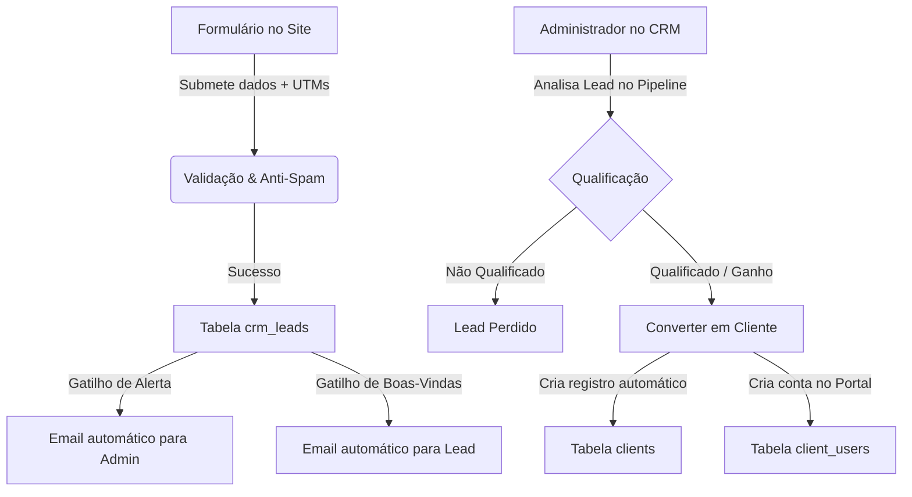

# Arquitetura de Geração de Leads e Site Institucional (LIMA Solutions ERP)

Este documento estabelece a especificação arquitetônica detalhada para a integração do Site Institucional, captação automatizada de Leads, pipeline comercial do CRM e disparos de e-mails transacionais.

---

## 1. Estrutura do Site Institucional
O site institucional será projetado para ter alta conversão (Landing Page / Site Multiuso) com foco na experiência do utilizador e performance mobile.

### Mapa do Site (Páginas principais)
* **Home / Início**: Apresentação da empresa, diferenciais de mercado, depoimentos e chamadas para ação (CTA) em destaque.
* **Serviços**: Descrição detalhada dos serviços oferecidos (Mudanças residenciais, comerciais, transporte de objetos pesados, guarda-móveis).
* **Sobre Nós**: História da empresa, valores corporativos e compromisso de segurança.
* **Orçamento / Simulação**: Formulário interativo completo para captação de leads.
* **Contacto**: Informações de localização, telefones e formulário de mensagem direta.

### Princípios de Design e UX
* **Visual Premium**: Utilização da fonte moderna *Outfit*, paleta de cores consistente com a identidade visual da empresa (usando o `main_color` dinâmico do banco de dados), transições suaves e design responsivo (Mobile-first).
* **Foco em Leads**: Todos os caminhos e botões de chamada para ação (CTAs) direcionam o visitante para o formulário interativo de orçamento.
* **Performance**: Código HTML5 limpo, sem dependências pesadas, minimizando o tempo de primeiro carregamento (LCP).

---

## 2. Fluxo Lead → CRM → Cliente
O fluxo foi desenhado para ser unidirecional e livre de inconsistências, garantindo rastreabilidade desde o primeiro clique.



---

## 3. Modelo de Dados para `crm_leads`
A tabela `crm_leads` será estruturada para suportar múltiplos metadados comerciais e parâmetros de marketing digital.

```sql
CREATE TABLE crm_leads (
    id INT AUTO_INCREMENT PRIMARY KEY,
    company_id INT NOT NULL,
    status VARCHAR(50) NOT NULL DEFAULT 'New', -- 'New', 'Contacted', 'Proposal Sent', 'Negotiation', 'Won', 'Lost'
    name VARCHAR(255) NOT NULL,
    email VARCHAR(255) NOT NULL,
    phone VARCHAR(50) NULL,
    address_from TEXT NULL, -- Endereço de origem
    address_to TEXT NULL,   -- Endereço de destino
    service_type VARCHAR(100) NULL, -- ex: 'Moving', 'Storage', 'Cleaning'
    estimated_date DATE NULL, -- Data prevista para o serviço
    description TEXT NULL, -- Detalhes ou observações do utilizador
    
    -- Parâmetros de Marketing (Ads & Origem)
    utm_source VARCHAR(100) NULL,
    utm_medium VARCHAR(100) NULL,
    utm_campaign VARCHAR(100) NULL,
    utm_term VARCHAR(100) NULL,
    utm_content VARCHAR(100) NULL,
    referer_url TEXT NULL,
    ip_address VARCHAR(45) NULL,
    
    -- Gestão Interna
    assigned_to INT NULL, -- FK para users(id)
    notes TEXT NULL,      -- Notas internas da equipa comercial
    value DECIMAL(12,2) DEFAULT 0.00, -- Valor estimado do negócio
    
    created_at TIMESTAMP DEFAULT CURRENT_TIMESTAMP,
    updated_at TIMESTAMP DEFAULT CURRENT_TIMESTAMP ON UPDATE CURRENT_TIMESTAMP,
    converted_at TIMESTAMP NULL, -- Data de conversão em cliente
    
    FOREIGN KEY (company_id) REFERENCES companies(id),
    FOREIGN KEY (assigned_to) REFERENCES users(id)
) ENGINE=InnoDB DEFAULT CHARSET=utf8mb4 COLLATE=utf8mb4_unicode_ci;

-- Índices recomendados para consultas comerciais
CREATE INDEX idx_leads_company_status ON crm_leads(company_id, status);
CREATE INDEX idx_leads_created ON crm_leads(created_at);
```

---

## 4. Pipeline Comercial (Estágios do Funil)
O CRM do ERP terá uma interface dedicada para visualização em modo lista e modo Kanban, cobrindo os seguintes estágios:

1. **Novo (`New`)**: Lead acabou de entrar pelo formulário ou foi inserido manualmente.
2. **Contactado (`Contacted`)**: Primeira tentativa de contacto por telefone ou e-mail concluída pela equipa.
3. **Proposta Enviada (`Proposal Sent`)**: Orçamento comercial oficial gerado e enviado ao lead.
4. **Negociação (`Negotiation`)**: Revisão de preços, datas ou termos adicionais.
5. **Ganho (`Won`)**: Orçamento aceite. O lead é convertido em cliente formal.
6. **Perdido (`Lost`)**: Lead rejeitou a proposta ou foi considerado desqualificado. O motivo da perda é registado em `notes`.

---

## 5. Integração com Clientes Existentes
Para evitar duplicação de dados e manter a consistência histórica:
* **Verificação Automatizada**: No momento da submissão do lead, o sistema consulta a tabela `clients` procurando por duplicados exatos de `email` ou `phone`.
* **Identificação Visual no CRM**: Se o e-mail pertencer a um cliente existente, o lead é marcado com uma etiqueta `[Cliente Existente]`.
* **Fluxo de Conversão Simples**: Se o lead for qualificado como "Ganho" mas pertencer a um cliente já registado, o sistema apenas cria o novo projeto/orçamento vinculado ao cliente existente, em vez de duplicar a ficha de cliente.

---

## 6. Estratégia de E-mails Automáticos
Para garantir alta entregabilidade e automação fluida, os e-mails serão geridos via fila ou disparados de forma transacional por gatilhos.

### Gatilhos e Conteúdo dos E-mails
1. **Submissão do Lead (Cliente)**:
   - *Assunto*: Recebemos o seu pedido de orçamento!
   - *Conteúdo*: Confirmação dos dados recebidos, explicação do prazo de análise da equipa (ex: "em até 24 horas úteis") e contactos diretos.
2. **Alerta de Novo Lead (Administrador/Equipa)**:
   - *Assunto*: 🚨 Novo Lead Recebido! - [Nome do Lead]
   - *Conteúdo*: Resumo dos dados de contacto, tipo de serviço, endereços e link direto para o painel de atendimento no CRM.
3. **Conversão de Lead / Criação de Acesso (Cliente)**:
   - *Assunto*: A sua conta no Portal do Cliente está ativa!
   - *Conteúdo*: E-mail de boas-vindas, URL de acesso ao portal e credenciais/instruções para o primeiro login.

### Infraestrutura Técnica
* **Motor**: Integração do **PHPMailer** no núcleo do ERP.
* **Configuração**: Credenciais SMTP seguras, porta criptografada (SSL/TLS), configuradas e lidas estritamente a partir do diretório seguro `private_lima`.
* **Autenticação de Domínio**: Configurações de SPF, DKIM e DMARC ativas no servidor de e-mail institucional para evitar marcação como Spam.

---

## 7. Segurança Anti-Spam
Medidas preventivas para bloquear ataques robóticos de preenchimento de formulários:

* **Técnica Honeypot**: Inclusão de um campo oculto via CSS no formulário (ex: `name="website_url"`). Se o campo for preenchido (robôs costumam preencher todos os campos), a requisição é rejeitada silenciosamente sem processamento de banco de dados ou e-mail.
* **IP Rate Limiting**: Limite máximo de submissões de formulário por endereço IP (máximo de 3 submissões por hora).
* **Validação de Domínio de E-mail**: Verificação de sintaxe básica em Javascript e PHP, acompanhada de validação de registro MX em PHP (`checkdnsrr()`) antes de aceitar a submissão.
* **CSRF Token**: Validação de token de sessão obrigatória no endpoint de recepção de leads.

---

## 8. Integração Futura com Google Ads e Meta Ads
O sistema estará preparado para mensurar campanhas pagas nativamente:

* **Rastreamento de UTMs**: Gravação estrita dos parâmetros `utm_source`, `utm_medium`, `utm_campaign` no cookie do navegador durante a navegação e leitura no momento do envio do formulário.
* **Webhook de Conversão (Meta API / Google Analytics 4)**: 
  - Estrutura pronta para disparar um evento `Lead` ou `Conversion` para as APIs do Facebook/Meta Conversions API e Google Measurement Protocol no momento exato em que o lead atinge o status "Won" ou no envio do formulário de origem.

---

## 9. Métricas e KPIs Comerciais
O dashboard operacional do ERP passará a exibir estatísticas de conversão e aquisição:

* **CPL (Custo por Lead)**: Integração lógica do custo das campanhas (inserido manualmente) dividido pelo total de leads.
* **Taxa de Conversão**: Percentual de leads que transitaram de `New` para `Won`.
* **Tempo Médio de Atendimento (SLA)**: Diferença de tempo entre o `created_at` do lead e o primeiro registo de alteração de status para `Contacted`.
* **Receita Gerada por Origem**: Total financeiro faturado originado de leads por canal (Google Ads, Meta Ads, Orgânico, Recomendação).

---

## 10. Plano de Implementação por Etapas
O desenvolvimento ocorrerá de forma controlada após a aprovação desta arquitetura:

1. **Etapa A (Banco de Dados)**: Criação da tabela `crm_leads` e índices de performance.
2. **Etapa B (Formulário e Site)**: Desenvolvimento do site institucional estático e do endpoint seguro de recepção de leads com honeypot e rate limit.
3. **Etapa C (Painel de Atendimento)**: Criação das telas de listagem, visualização de leads, e manipulação de status comercial no ERP administrativo.
4. **Etapa D (Disparos de E-mail)**: Instalação do PHPMailer e configuração dos templates de e-mail dinâmicos.
5. **Etapa E (Testes e Ajustes)**: Verificação operacional ponta a ponta através de scripts de teste de integração locais e remotos.
