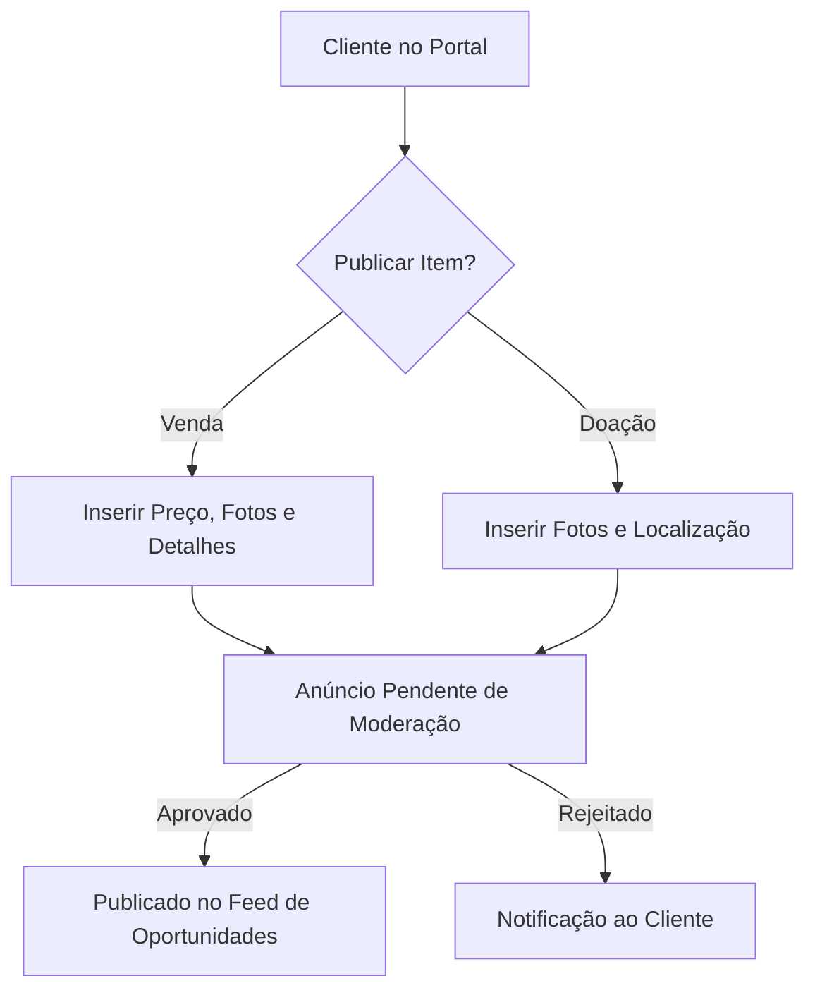

# Arquitetura e Engenharia do Marketplace LIMA (MARKETPLACE_ARCHITECTURE)

Este documento define a arquitetura funcional, modelo de dados e integrações planejadas para o futuro **Marketplace LIMA**, que permitirá aos clientes vender ou doar móveis durante o processo de mudança.

---

## 1. Casos de Uso e Fluxos Operacionais



### 1.1 Venda de Móveis
*   Clientes publicam itens que não querem levar para a nova residência.
*   Campos obrigatórios: Título, Descrição, Fotos (mínimo 1), Preço (CHF), Categoria.

### 1.2 Doações
*   Clientes doam itens para evitar custos de descarte.
*   Campos obrigatórios: Descrição, Fotos, Categoria, Localização de recolha.

### 1.3 Oportunidades
*   Vitrine pública de itens agrupados por estado de conservação: *Usados*, *Seminovos* e *Doações*.

---

## 2. Integrações do Ecossistema

### 2.1 ERP Core
*   **Projetos & Mudanças**: Cada anúncio no marketplace deve opcionalmente estar vinculado a um `project_id`. Isso ajuda a planejar a logística (ex: *"Deseja que a equipa do seu déménagement recolha este item vendido/doado no dia da mudança?"*).
*   **Logística**: Agendamento de recolha integrada no planeamento de frota.

### 2.2 CRM & Leads
*   Identificação de novos leads de compra/venda de móveis através do interesse demonstrado em anúncios de doação.
*   Registo de interações para campanhas de remarketing.

### 2.3 Portal do Cliente
*   Painel pessoal do anunciante para: Criar, Editar, Desativar (Vendido/Doado/Retirado) e gerir contactos recebidos de potenciais interessados.

---

## 3. Modelo de Dados Relacional (Esquema Proposto)

### 3.1 Entidade: `marketplace_categories`
*   `id` (INT, PK)
*   `name` (VARCHAR)
*   `slug` (VARCHAR)

### 3.2 Entidade: `marketplace_items`
*   `id` (INT, PK)
*   `company_id` (INT, FK)
*   `client_id` (INT, FK) — Vendedor/Doador
*   `project_id` (INT, FK, NULL) — Projeto de mudança associado
*   `category_id` (INT, FK)
*   `type` (ENUM: 'sale', 'donation')
*   `title` (VARCHAR)
*   `description` (TEXT)
*   `price` (DECIMAL 10,2, NULL)
*   `condition` (ENUM: 'new', 'like_new', 'good', 'used')
*   `location` (VARCHAR) — Para recolha
*   `status` (ENUM: 'pending_approval', 'active', 'sold', 'donated', 'rejected')
*   `rejection_reason` (TEXT, NULL)
*   `created_at` (TIMESTAMP)

### 3.3 Entidade: `marketplace_photos`
*   `id` (INT, PK)
*   `item_id` (INT, FK)
*   `filename` (VARCHAR)
*   `is_primary` (TINYINT)

---

## 4. Arquitetura da API `/api/v1/marketplace/`

Endpoints reservados para desenvolvimento futuro:
*   `GET /api/v1/marketplace/items` — Listagem pública filtrada (pesquisa, tipo, preço, categoria).
*   `POST /api/v1/marketplace/items` — Criar anúncio (Upload de fotos integrado).
*   `PUT /api/v1/marketplace/items?id=X` — Atualizar dados do anúncio ou alterar status.
*   `DELETE /api/v1/marketplace/items?id=X` — Soft delete do anúncio.
*   `POST /api/v1/marketplace/items/moderate` — Endpoint administrativo para aprovação/rejeição.

---

## 5. Permissões, Riscos e Mitigação

### 5.1 Permissões
*   **Público**: Leitura de anúncios ativos.
*   **Clientes Autenticados**: Criação de anúncios e gestão de contactos dos seus próprios itens.
*   **Administrador**: Moderação total de conteúdo, categorias e banimento de utilizadores abusivos.

### 5.2 Riscos e Mitigações
*   **Fraude e Scams**: Mitigado limitando a publicação inicial apenas a clientes com contratos de mudança ativos ou validados no ERP.
*   **Armazenamento de Fotos**: Risco de sobrecarga do servidor com uploads massivos. Mitigação: Compressão no cliente (Canvas/JPEG) obrigatória antes do upload.

---

## 6. Roadmap Incremental

```text
Fase 4.1: Modelo & Moderação Backend (APIs Admin, Moderação de itens, DB)
Fase 4.2: Portal Cliente Anunciante (Criar anúncio, galeria de fotos, gerir estados)
Fase 4.3: Vitrine Pública de Oportunidades (Integração no Site Institucional com SEO)
```
