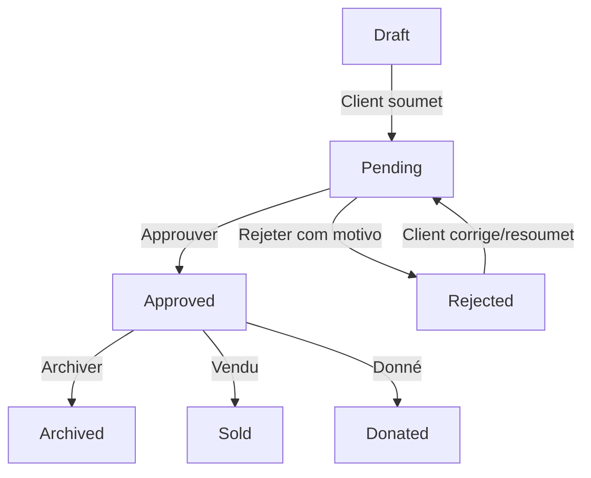

# Marketplace Moderation System

Ce document décrit le fonctionnement, les permissions, les statuts et les flux de travail du panneau d'administration pour la modération des annonces du Marketplace Lima.

---

## 1. Rôles et Permissions

La modération est réservée exclusivement aux profils d'administration :
- **Super Admin**
- **Admin**
- **Manager**

Toute tentative d'accès aux endpoints d'administration par un utilisateur non authentifié ou un client externe renvoie un code d'erreur `403 Forbidden`.

---

## 2. États des Annonces

Les annonces peuvent prendre l'un des états suivants :
- **Draft** : Annonce en cours de rédaction par le client, invisible du public.
- **Pending** : Annonce soumise par le client en attente de modération administrative.
- **Approved** : Annonce validée par l'administrateur, affichée sur le catalogue public.
- **Rejected** : Annonce refusée par l'administrateur (motif obligatoire).
- **Archived** : Annonce retirée du catalogue par l'administrateur ou par le client.
- **Sold** : Produit vendu par le client.
- **Donated** : Objet donné par le client.

---

## 3. Flux de Modération

---

## 4. Métriques Administratives

Les métriques clés d'analyse de performance du Marketplace sont intégrées au Tableau de Bord principal de l'administration :
- **Annonces en Attente (Pending)**
- **Annonces Approuvées (Approved)**
- **Annonces Vendues (Sold)**
- **Annonces Données (Donated)**
- **Intérêts Manifestés** (somme de tous les contacts générés sur les fiches produits)
