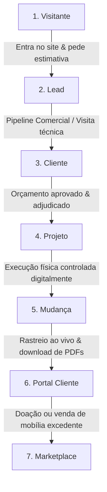
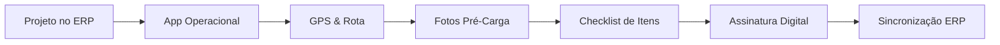

# LIMA Solutions ERP – Visão Estratégica 2030

> **Documento de Visão de Longo Prazo e Direção de Negócios**  
> **Versão**: 1.0  
> **Data**: 19 de Junho de 2026  
> **Estado**: Aprovado para Planeamento Global  

O **VISION_2030.md** estabelece a diretriz de longo prazo para a transformação digital e operacional da **Lima Déménagement**. Este documento unifica a estratégia empresarial, a experiência do utilizador (cliente e equipa) e a arquitetura tecnológica, servindo como a bússola para todas as decisões do ecossistema nos próximos anos.

---

## 1. Missão da Lima Déménagement

A missão da **Lima Déménagement** é redefinir a experiência de mobilidade e transição habitacional na Suíça, transformando o processo de mudança — tradicionalmente um dos momentos mais stressantes na vida de uma família ou empresa — numa experiência fluida, previsível, segura e ecologicamente responsável. 

Apoiada na excelência operacional e na tecnologia proprietária, a nossa missão assenta em três pilares:
*   **Tranquilidade Total**: Oferecer transparência absoluta através do acompanhamento digital em tempo real.
*   **Eficiência Sem Papel**: Eliminar a fricção administrativa interna e de campo, digitalizando 100% dos processos.
*   **Sustentabilidade**: Reduzir a pegada ecológica das mudanças promovendo a economia circular e a reutilização de bens através da nossa própria plataforma de marketplace.

---

## 2. Visão do Ecossistema Digital

O ecossistema **LIMA Solutions ERP** é concebido como uma plataforma integrada em que cada módulo desempenha um papel fundamental no ciclo de vida do cliente e na otimização de recursos.

```mermaid
grid
    ┌────────────────────────┐         ┌────────────────────────┐
    │   Site Institucional   │ ◄─────► │      CRM Comercial     │
    └───────────┬────────────┘         └───────────┬────────────┘
                │                                  │
                ▼                                  ▼
    ┌────────────────────────┐         ┌────────────────────────┐
    │    ERP Administrativo  │ ◄─────► │     Portal do Cliente  │
    └───────────┬────────────┘         └───────────┬────────────┘
                │                                  │
                ▼                                  ▼
    ┌────────────────────────┐         ┌────────────────────────┐
    │    App Operacional     │ ◄─────► │    Marketplace Lima    │
    └────────────────────────┘         └────────────────────────┘
```

### Componentes Integrados
*   **ERP Administrativo**: O núcleo decisor do ecossistema, onde reside a gestão financeira (Devis, Factures, IVA suíço), faturação em lote, controlo de acessos multi-empresa (`company_id`), auditoria estrita e relatórios de BI de suporte à administração.
*   **Portal do Cliente**: A porta de entrada do cliente final, oferecendo autonomia para aprovação de orçamentos, pagamento de faturas, comunicação direta com os gestores e rastreamento ao vivo do dia da mudança.
*   **Site Institucional**: O cartão de visita público da empresa. Otimizado para SEO local por cantões suíços, funciona como a ferramenta principal de captação de leads.
*   **CRM Comercial**: O motor de vendas que gere o pipeline comercial, permitindo que orçamentistas transformem rascunhos em propostas estruturadas em minutos.
*   **App Operacional**: A ferramenta móvel das equipas de campo (motoristas, chefes de equipa), permitindo o registo de presença, checklists fotográficos de carga/descarga e recolha de assinaturas legais sem recurso a papel.
*   **Marketplace Lima**: A extensão de sustentabilidade do ecossistema, permitindo aos clientes doar ou vender bens que não desejam transportar para a nova morada, fechando o ciclo da economia circular.

---

## 3. Jornada Completa do Cliente

A tecnologia acompanha o cliente desde o primeiro contacto online até ao pós-mudança, criando uma experiência contínua e sem silos.



1.  **Visitante**: Navega no site institucional, lê testemunhos e acede ao estimador de volumes.
2.  **Lead**: Envia o formulário de estimativa, preenchendo o inventário inicial. Os dados são inseridos diretamente no CRM do ERP.
3.  **Cliente**: Recebe o contacto do comercial, acede ao Portal do Cliente para visualizar a proposta (Devis) e aprova digitalmente as condições.
4.  **Projeto**: O orçamento aprovado é automaticamente convertido em projeto operacional no ERP administrativo, com tarefas e data agendadas.
5.  **Mudança**: No dia planeado, o cliente acompanha o progresso e o tráfego do camião de mudanças a partir do seu telemóvel.
6.  **Portal Cliente**: Após a entrega, assina o fecho do serviço, descarrega a fatura final (Facture) e o recibo de pagamento em PDF.
7.  **Marketplace**: Decide disponibilizar mobiliário que não cabe na nova residência para venda direta ou doação social.

---

## 4. Jornada Completa da Equipa

A equipa operacional no terreno recebe instruções precisas e envia dados em tempo real ao escritório, minimizando erros manuais e chamadas de esclarecimento.



*   **Projeto**: O gestor de tráfego distribui a ordem de serviço no ERP administrativo, definindo a equipa (Chefe de Equipa, motoristas e ajudantes).
*   **App Operacional**: A equipa inicia o dia de trabalho efetuando login e registando o check-in na morada de carga.
*   **GPS**: O sistema fornece a rota otimizada e o tempo estimado de chegada (ETA) atualizado.
*   **Fotos**: Registam-se fotografias do estado de conservação dos objetos valiosos antes do empacotamento, protegendo legalmente a empresa e o cliente.
*   **Checklist**: Confirmação visual de que todas as caixas e móveis listados foram carregados no camião.
*   **Assinatura**: O cliente assina a conformidade de receção diretamente no ecrã do telemóvel do Chefe de Equipa.
*   **ERP**: Todos os dados de tempos de paragem, fotografias e assinaturas são automaticamente integrados no perfil do projeto no ERP administrativo.

---

## 5. Marketplace Lima (Economia Circular)

O Marketplace atua como a ligação entre a responsabilidade ecológica e novas oportunidades de negócio, convertendo custos de eliminação de resíduos em valor para a comunidade.

*   **Venda**: Canal de venda direta de peças de mobiliário seminovas recolhidas ou descontinuadas por clientes, com taxas administrativas para a Lima Déménagement.
*   **Doação**: Artigos em bom estado encaminhados gratuitamente para famílias carenciadas ou instituições parceiras parceiras (ex: Diaconia), reduzindo o desperdício em aterros.
*   **Reutilização**: Incentivo a que o cliente, no momento da mudança, tome a decisão de escoar artigos em vez de pagar pelo transporte de peças que não irá utilizar.
*   **Economia Circular**: O ciclo de vida do móvel prolonga-se, com a Lima a encarregar-se do transporte e entrega do item adquirido na plataforma do marketplace.

---

## 6. Arquitetura Tecnológica

A sustentabilidade técnica do software exige uma separação estrita de responsabilidades, garantindo que novas interfaces não gerem perturbações no ERP administrativo central.

```text
┌─────────────────────────────────────────────────────────────────────────┐
│                          APIs Rest (/api/v1/)                           │
│     Abstração de Acesso à Base de Dados e Lógica de Negócio Comum       │
└────────────────────────────────────┬────────────────────────────────────┘
                                     │
         ┌───────────────────────────┼───────────────────────────┐
         ▼                           ▼                           ▼
┌─────────────────┐         ┌─────────────────┐         ┌─────────────────┐
│    ERP Admin    │         │ Portal Cliente  │         │   Marketplace   │
│ (PHP Core MVC)  │         │ (Web / React)   │         │  (Web Pública)  │
└─────────────────┘         └─────────────────┘         └─────────────────┘
                                     │
                                     ▼
                            ┌─────────────────┐
                            │ App Operacional │
                            │ (Mobile Native) │
                            └─────────────────┘
```

*   **API-first**: A lógica de cálculo financeiro (IVA, descontos), validação de sessões, imutabilidade e concorrência reside na camada de API.
*   **ERP Core**: Consome a API interna e atua como o motor de gestão e relatórios.
*   **Portal & Marketplace**: Aplicações web independentes que comunicam via JSON HTTP requests seguras.
*   **App Mobile**: Comunica exclusivamente através de endpoints otimizados em `/api/v1/driver/`.

---

## 7. Roadmap de Crescimento (Visão Temporal)

```
2025             2026               2027              2028               2030
 ───┼────────────────┼──────────────────┼─────────────────┼──────────────────┼───
    │                │                  │                 │                  │
    ▼                ▼                  ▼                 ▼                  ▼
Consolidação     Captação Leads     App Terreno       Portal Premium     Ecosistema Maduro
ERP Core e       Site e CRM         Fase Mobile       Acompanhamento     Marketplace e
Portal Fase 1    Comercial          Motoristas        GPS e Fotos        Circularidade
```

*   **2025**: Consolidação do ERP core administrativo, módulo de faturação estável e Portal de Cliente Fase 1.
*   **2026**: Lançamento do site institucional focado em SEO, estimador de inventário interativo e CRM de Leads comercial.
*   **2027**: Introdução da App Operacional para equipas de campo, cobrindo o tracking de tempos (timesheets mobile) e checklists.
*   **2028**: Upgrade do Portal do Cliente para a versão Premium, com transmissão de fotos do terreno e localização geográfica ativa das carrinhas de transporte.
*   **2030**: Lançamento do Marketplace Lima, atingindo a maturidade digital com economia circular totalmente automatizada e integrada ao CRM.

---

## 8. Objetivos de Negócio

*   **Captação de Leads**: Triplicar a captação de leads orgânicos na Suíça nos primeiros 12 meses após a conclusão da Fase 2.
*   **Conversão**: Aumentar a taxa de conversão de leads em orçamentos adjudicados em 25%, reduzindo o tempo de resposta comercial para menos de 4 horas.
*   **Automação**: Reduzir em 80% o tempo administrativo dedicado à aprovação de folhas de horas e emissão manual de faturas.
*   **Experiência do Cliente**: Obter um Net Promoter Score (NPS) superior a 90 através da transparência total fornecida no Portal do Cliente.
*   **Escalabilidade**: Habilitar a entrada rápida em novos mercados linguísticos na Suíça (Alemão, Italiano) sem necessidade de reconstruir bases de dados.

---

## 9. Princípios de Desenvolvimento

1.  **Não duplicar lógica (DRY - Don't Repeat Yourself)**: A lógica de validação financeira e isolamento de dados por empresa reside exclusivamente num local (ex: helpers centralizados do ERP e middlewares).
2.  **Não criar silos**: Os dados de clientes, transações e projetos pertencem a uma única base de dados relacional normalizada com restrições estritas de isolamento por `company_id`.
3.  **Reutilizar APIs**: As novas aplicações utilizam APIs existentes na pasta `/api/v1/`. Novas necessidades devem estender estas APIs de forma retrocompatível.
4.  **Documentar tudo**: Alterações à base de dados devem ser registadas através de migrações estruturadas no histórico de controlo de versões.
5.  **Segurança por padrão**: Toda a comunicação transacional é blindada contra CSRF, XSS e SQL Injection. As sessões administrativas, de cliente e de campo operam de forma isolada e restrita a tokens com privilégios mínimos.
