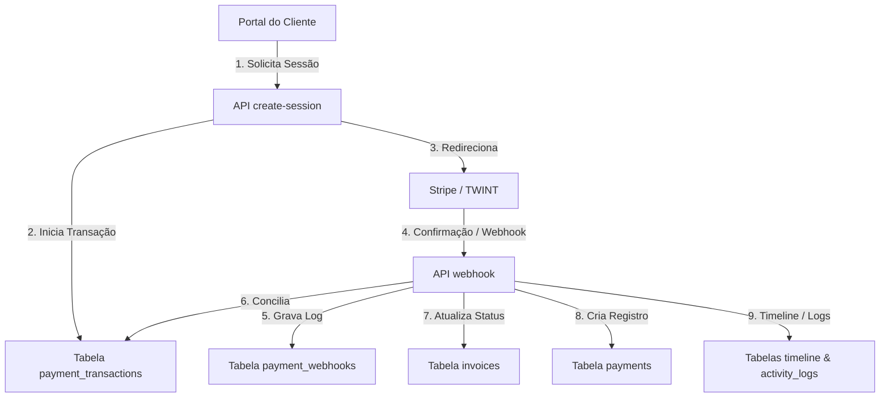

# LIMA Solutions ERP – Arquitetura do Gateway de Pagamentos (Fase A)
**Data de Especificação**: 20 de Junho de 2026  
**Status**: Planeamento Tecnológico (Aguardando Aprovação)  
**Escopo**: Especificação de Integração Online (Stripe & TWINT)  
**Versão Base**: V1.3-Hardened

Este documento estabelece o design de arquitetura, modelo de dados, especificação de APIs, fluxos de integração e requisitos de segurança para a introdução de pagamentos online no LIMA Solutions ERP.

---

## 1. Objetivos de Negócio (Business Objectives)

A integração de meios de pagamento digitais no ERP visa atingir os seguintes resultados:
* **Pagamento de Faturas Online**: Permitir que o cliente final liquide faturas diretamente através de cartões de crédito/débito, Apple Pay, Google Pay ou TWINT com um clique.
* **Redução do Ciclo de Cobrança (DSO)**: Acelerar o recebimento de valores após a emissão de orçamentos convertidos, oferecendo comodidade ao cliente final.
* **Automação Financeira**: Eliminar a necessidade de lançamentos manuais redundantes no módulo de pagamentos do ERP para faturas pagas online.
* **Self-Service no Portal do Cliente**: Dar autonomia ao cliente para gerenciar pendências financeiras, baixar recibos automáticos e verificar o status de quitação em tempo real.

---

## 2. Provedores Suportados (Supported Providers)

O motor de pagamentos será projetado sob uma abstração de driver (Factory Pattern), suportando inicialmente dois provedores e permitindo a acoplagem futura de novas APIs:

### Fase A (Prioridade Imediata)
* **Stripe**: Gateway principal para processamento global de cartões de crédito/débito (Visa, Mastercard, American Express), Apple Pay e Google Pay.
* **TWINT**: Meio de pagamento preferencial e de maior adesão na Suíça, operado via redirecionamento de aplicativo móvel ou leitura de QR-Code.

### Fase Futura (Roadmap)
* **PostFinance**: Integração com a infraestrutura financeira postal suíça.
* **APIs de Transferência Bancária (Open Banking / ISO 20022)**: Leitura automatizada e conciliação de faturas via arquivos de notificação de crédito (QR-Bills camt.054).
* **PayPal**: Driver secundário para transações internacionais.

---

## 3. Pontos de Integração no ERP (ERP Integration Points)



* **Invoices (Faturas)**: A tabela `invoices` interage diretamente tendo seu status atualizado (de `Sent` ou `Partially Paid` para `Paid`) e o saldo devedor (`balance_due`) zerado após a confirmação.
* **Payments (Pagamentos)**: A confirmação de transação online gera automaticamente um registro correspondente na tabela `payments` com a indicação `payment_method = 'Stripe'` ou `'TWINT'`, gerando o recibo em PDF nativo.
* **Portal do Cliente**: A interface do portal passa a renderizar o botão "Pagar Online" em faturas ativas que possuam saldo pendente.
* **Activity Logs & Timeline**: Cada mudança de estado de pagamento dispara uma gravação no log de auditoria do usuário do sistema e insere uma entrada histórica no `entity_timeline` correspondente da fatura e do cliente.
* **Notifications**: O sistema dispara e-mails de confirmação automáticos (recibo de pagamento) para o cliente e notificações internas de "Fatura Liquidada" no dashboard do administrador.

---

## 4. Modelagem de Dados (Database Design)

Três novas tabelas normalizadas serão criadas com isolamento estrito por `company_id`:

```sql
-- 1. Tabela de Transações de Pagamento
CREATE TABLE IF NOT EXISTS `payment_transactions` (
    `id` INT AUTO_INCREMENT PRIMARY KEY,
    `company_id` INT NOT NULL,
    `invoice_id` INT NOT NULL,
    `provider` VARCHAR(30) NOT NULL, -- 'stripe' | 'twint'
    `provider_session_id` VARCHAR(255) NOT NULL, -- ID do Checkout no Provedor
    `provider_payment_intent` VARCHAR(255) DEFAULT NULL,
    `amount` DECIMAL(10,2) NOT NULL,
    `currency` VARCHAR(10) DEFAULT 'CHF',
    `status` VARCHAR(30) DEFAULT 'Pending', -- 'Pending' | 'Succeeded' | 'Failed' | 'Expired'
    `error_message` TEXT DEFAULT NULL,
    `idempotency_key` VARCHAR(64) NOT NULL UNIQUE,
    `created_at` TIMESTAMP DEFAULT CURRENT_TIMESTAMP,
    `updated_at` TIMESTAMP DEFAULT CURRENT_TIMESTAMP ON UPDATE CURRENT_TIMESTAMP,
    INDEX `idx_pay_tx_company_invoice` (`company_id`, `invoice_id`),
    INDEX `idx_pay_tx_provider_session` (`provider`, `provider_session_id`),
    FOREIGN KEY (`company_id`) REFERENCES `companies` (`id`) ON DELETE RESTRICT,
    FOREIGN KEY (`invoice_id`) REFERENCES `invoices` (`id`) ON DELETE RESTRICT
) ENGINE=InnoDB DEFAULT CHARSET=utf8mb4 COLLATE=utf8mb4_unicode_ci;

-- 2. Tabela de Log de Webhooks
CREATE TABLE IF NOT EXISTS `payment_webhooks` (
    `id` INT AUTO_INCREMENT PRIMARY KEY,
    `company_id` INT NOT NULL,
    `provider` VARCHAR(30) NOT NULL,
    `event_id` VARCHAR(150) NOT NULL, -- ID único enviado pelo provedor para desduplicação
    `payload` LONGTEXT NOT NULL, -- JSON Bruto recebido para auditoria
    `processed` TINYINT(1) DEFAULT 0,
    `error_details` TEXT DEFAULT NULL,
    `created_at` TIMESTAMP DEFAULT CURRENT_TIMESTAMP,
    UNIQUE KEY `idx_webhook_event` (`provider`, `event_id`),
    INDEX `idx_webhook_company` (`company_id`),
    FOREIGN KEY (`company_id`) REFERENCES `companies` (`id`) ON DELETE RESTRICT
) ENGINE=InnoDB DEFAULT CHARSET=utf8mb4 COLLATE=utf8mb4_unicode_ci;

-- 3. Tabela de Reembolsos / Estornos
CREATE TABLE IF NOT EXISTS `payment_refunds` (
    `id` INT AUTO_INCREMENT PRIMARY KEY,
    `company_id` INT NOT NULL,
    `transaction_id` INT NOT NULL,
    `provider_refund_id` VARCHAR(255) NOT NULL,
    `amount` DECIMAL(10,2) NOT NULL,
    `reason` TEXT DEFAULT NULL,
    `status` VARCHAR(30) DEFAULT 'Pending', -- 'Pending' | 'Succeeded' | 'Failed'
    `created_by` INT NOT NULL,
    `created_at` TIMESTAMP DEFAULT CURRENT_TIMESTAMP,
    INDEX `idx_refund_company_tx` (`company_id`, `transaction_id`),
    FOREIGN KEY (`company_id`) REFERENCES `companies` (`id`) ON DELETE RESTRICT,
    FOREIGN KEY (`transaction_id`) REFERENCES `payment_transactions` (`id`) ON DELETE RESTRICT,
    FOREIGN KEY (`created_by`) REFERENCES `users` (`id`) ON DELETE RESTRICT
) ENGINE=InnoDB DEFAULT CHARSET=utf8mb4 COLLATE=utf8mb4_unicode_ci;
```

---

## 5. Especificação de APIs (API Design)

Todas as rotas seguirão a padronização API-First do ERP sob `/api/v1/payments/`:

### A. Criar Sessão de Checkout
* **Endpoint**: `/api/v1/payments/create-session.php`
* **Método**: `POST`
* **Payload**:
  ```json
  {
    "invoice_id": 123,
    "provider": "stripe",
    "success_url": "https://limasolutions.ch/portal/invoices.php?status=success",
    "cancel_url": "https://limasolutions.ch/portal/invoices.php?status=cancelled"
  }
  ```
* **Resposta (Sucesso)**:
  ```json
  {
    "success": true,
    "transaction_id": 456,
    "checkout_url": "https://checkout.stripe.com/pay/cs_test_..."
  }
  ```

### B. Processamento do Webhook
* **Endpoint**: `/api/v1/payments/webhook.php`
* **Método**: `POST`
* **Headers Necessários**: `Stripe-Signature` ou assinaturas criptográficas correspondentes.
* **Payload**: Envio dinâmico do JSON assinado pelo Provedor.
* **Resposta (Sucesso)**: Retorna HTTP `200 OK` (obrigatório para cessar retentativas dos gateways).

### C. Consulta de Status
* **Endpoint**: `/api/v1/payments/status.php`
* **Método**: `GET`
* **Parâmetros**: `?transaction_id=456`
* **Resposta**:
  ```json
  {
    "success": true,
    "status": "Succeeded",
    "invoice_status": "Paid",
    "amount": 1850.00,
    "currency": "CHF"
  }
  ```

---

## 6. Requisitos de Segurança (Security Requirements)

1. **Validação de Assinaturas de Webhook**: A API do Webhook decodifica o payload utilizando obrigatoriamente a chave secreta pública de assinatura do provedor (ex: `Webhook Secret Key` da Stripe). Chamadas sem assinatura válida são rejeitadas com erro HTTP `401 Unauthorized`.
2. **Prevenção de Ataques de Replay**: Utilização de timestamps assinados nos cabeçalhos das requisições com validade máxima de 5 minutos, rejeitando chamadas antigas capturadas na rede.
3. **Idempotência (Idempotency)**: Cada sessão de checkout é gerada a partir de uma `idempotency_key` única (gerada via hash SHA-256 do `invoice_id` + `balance_due` + data da transação). Isso impede a criação de duas transações de débito simultâneas para a mesma fatura pelo mesmo cliente.
4. **Armazenamento de Dados de Cartão (PCI-DSS)**: O ERP **nunca** processará ou armazenará em disco/banco de dados números de cartões de crédito, códigos de segurança (CVV) ou tokens sensíveis. Todo o processamento de captura de dados de pagamento ocorre exclusivamente em ambiente seguro do gateway (Stripe Checkout / TWINT redirect).

---

## 7. Regras Contábeis e de Faturamento (Accounting Rules)

A integração deve respeitar os status e regras fiscais estabelecidas na linha de base imutável do faturamento:

* **Invoice Paid (Fatura Paga)**:
  - Disparado quando o valor capturado cobre exatamente o saldo devedor (`balance_due`).
  - Status da fatura é modificado para `Paid`. O campo `balance_due` é zerado.
  - Gera um registro correspondente na tabela `payments` vinculado à fatura.
* **Partial Payment (Pagamento Parcial)**:
  - Permitido caso a fatura permita parcelamento ou o pagamento de um sinal.
  - O campo `balance_due` da fatura é decrementado pelo valor pago.
  - Status da fatura é atualizado para `Partially Paid`.
* **Failed Payment (Falha no Pagamento)**:
  - Registrado na tabela `payment_transactions` como `Failed` para fins de log e auditoria de erros.
  - O status da fatura permanece inalterado (`Sent`). Nenhuma alteração contábil ocorre.
* **Refunded Payment (Estornos / Reembolsos)**:
  - O estorno é iniciado exclusivamente pelo ERP Admin (via Super Admin) chamando a API de reembolso.
  - O status do pagamento original passa para `Refunded` ou o saldo da fatura é atualizado adicionando novamente o valor estornado à dívida.

---

## 8. Fluxo Operacional no Portal do Cliente

```text
  Cliente
     │
     ▼ (Acessa o Portal do Cliente)
  Visualiza Fatura Ativa (Saldo Pendente)
     │
     ▼ (Clica no botão "Pagar Online")
  Escolhe Provedor (Stripe ou TWINT) e clica em Confirmar
     │
     ▼ (ERP cria sessão e redireciona)
  Redirecionado para Ambiente Seguro do Provedor (Stripe Checkout / TWINT)
     │
     ▼ (Efetua o pagamento com sucesso)
  Redirecionado de Volta para a URL de Sucesso no Portal do Cliente
     │
     ▼ (Provedor envia notificação em background)
  Webhook Recebido ➔ ERP Valida ➔ Atualiza Fatura ➔ Cria Registro em Payments
```

---

## 9. Riscos e Mitigações

* **Pagamentos Duplicados**:
  - *Risco*: Cliente clica duas vezes no botão ou abre duas abas de checkout diferentes.
  - *Mitigação*: Bloqueio de transações simultâneas. O ERP confere se já existe uma transação pendente com status ativo para aquela fatura antes de gerar uma nova sessão de checkout.
* **Falhas ou Atraso no Recebimento de Webhooks**:
  - *Risco*: Cliente paga no provedor, fecha o navegador e o webhook do provedor demora para chegar devido a problemas de rede.
  - *Mitigação*: Quando o cliente retornar à página de sucesso, o frontend realiza chamadas periódicas (polling com backoff) para `/api/v1/payments/status.php` para verificar e forçar a validação em tempo real se o webhook estiver atrasado.
* **Problemas de Câmbio / Moedas**:
  - *Risco*: Transações iniciadas em CHF cobradas em Euros por erro de conversão.
  - *Mitigação*: A moeda da transação é forçada para `CHF` (definido nas constantes do ERP), validando no payload de confirmação se o montante final coincide com o valor exato registrado na fatura.

---

## 10. Recomendação de Implementação

### Ordem de Implementação Recomendada
1. **Stripe (Fase A - Etapa 1)**
2. **TWINT (Fase A - Etapa 2)**

### Justificativa Técnica
* A Stripe oferece uma suíte de APIs e SDKs extremamente documentada com bibliotecas PHP oficiais robustas, facilitando a estruturação das tabelas base, tratamento de webhooks e fluxo de checkout unificado (Apple Pay/Google Pay/Cartões) com baixo esforço inicial.
* A infraestrutura de desenvolvimento e logs do gateway Stripe pode ser totalmente testada localmente em modo sandbox de forma transparente.
* A integração com a TWINT será acoplada como um driver secundário herdando toda a lógica de persistência e tratamento de transações geradas na Etapa 1 da Stripe, diminuindo o risco de incompatibilidade ou duplicação de dados.
