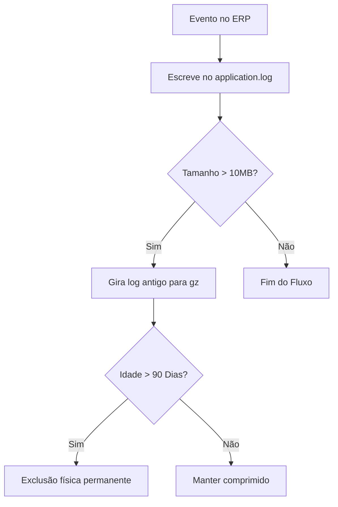

# LIMA Solutions ERP – Relatório de Hardening de Produção
**Data do Relatório**: 19 de Junho de 2026  
**Versão**: 1.0 (Fase de Estabilização e Auditoria de Segurança)  
**Ambiente**: Produção (Infomaniak PHP 8.4) e Desenvolvimento Local

Este relatório técnico consolida os resultados do diagnóstico de segurança, performance móvel, automação de backups e saúde da base de dados. Fornece recomendações estruturadas para mitigar riscos antes do deploy definitivo da Fase 2.

---

## 1. Exposição de Scripts de Migração e Debug (Migration Scripts Exposure)

Foi realizada a varredura completa dos diretórios públicos à procura de scripts administrativos temporários ou de testes que possam expor informações do banco de dados ou permitir execuções indevidas.

### Inventário e Classificação de Arquivos

| Arquivo / Script | Localização | Classificação | Risco Associado | Ação Recomendada | Esforço |
| :--- | :--- | :--- | :--- | :--- | :--- |
| `run_migration_v11.php` | `public_site/admin/` | **Safe to archive** | Médio (Permite reexecução de DDLs antigos se não validado) | Mover para pasta segura fora do web root ou excluir. | 5 min |
| `run_migration_v12.php` | `public_site/admin/` | **Safe to archive** | Médio | Mover para pasta segura fora do web root ou excluir. | 5 min |
| `run_migration_v13.php` | `public_site/admin/` | **Safe to archive** | Médio | Mover para pasta segura fora do web root ou excluir. | 5 min |
| `run_migration_v14.php` | `public_site/admin/` | **Safe to archive** | Médio | Mover para pasta segura fora do web root ou excluir. | 5 min |
| `run_migration_v15.php` | `public_site/admin/` | **Safe to archive** | Médio | Mover para pasta segura fora do web root ou excluir. | 5 min |
| `test_scoring.php` | `public_site/admin/` | **Safe to remove** | Baixo (Exposição de mock e estrutura de lead scoring) | Excluir arquivo de teste do ambiente de produção. | 2 min |
| `dbg_kpi.php` | `public_site/admin/` | **Safe to remove** | Baixo (Exposição de métricas internas do ERP) | Excluir. | 2 min |
| `audit_helper.php` | `public_site/admin/` | **Safe to remove** | Baixo (Exposição de detalhes das tabelas) | Excluir. | 2 min |
| `db_info.php` | `public_site/admin/` | **Must remain** | Alto (Se acessado publicamente) | Manter apenas com validação estrita de sessão `super_admin`. | 10 min |
| `observability.php` | `public_site/admin/` | **Must remain** | Alto (Painel de Métricas e Visualizador de Logs) | Garantir proteção rígida via `auth.php` (restrito a admin). | 5 min |
| `run_uat_tests.php` | `public_site/db/` | **Safe to archive** | Baixo (Exposição de dados de teste de aceitação) | Mover para repositório local. Excluir da produção. | 2 min |
| `migrate*.py` / `upload*.py` / `fix_*.py` / `cleanup*.py` | Raiz do projeto | **Safe to remove** | Baixo (Apenas scripts locais utilitários de dev) | Excluir do servidor de produção (manter localmente no Git). | 5 min |

---

## 2. Gestão de Logs (Log Management)

O sistema centraliza logs de eventos operacionais críticos em `/private_lima/logs/application.log`. Sem controle de rotação, este arquivo crescerá arbitrariamente, degradando a performance de leitura do painel administratório.

### Riscos Identificados
* **Crescimento Descontrolado**: Esgotamento do espaço em disco em longo prazo.
* **Sobrecarga de E/S**: Lentidão em requisições de escrita em arquivos gigantescos pelo PHP.
* **Privacidade**: Retenção indefinida de logs de logins e dados operacionais de motoristas.

### Políticas Propostas



* **Política de Rotação (Rotation Policy)**:
  - Executar rotação diária ou quando o arquivo ultrapassar **10 MB**.
  - Renomear o log atual para `application-YYYY-MM-DD.log` e comprimi-lo em formato `.gz` (`application-YYYY-MM-DD.log.gz`).
* **Política de Retenção (Retention Policy)**:
  - Manter logs rotativos comprimidos por no máximo **90 dias**.
  - Configurar um cron job automático para apagar os arquivos `.gz` mais antigos que 90 dias em `/private_lima/logs/`.
* **Esforço Estimado**: 1.5 horas (implementação de script PHP auxiliar de log rotate acionado no dashboard ou via cron).

---

## 3. Automação e Monitoramento de Backups (Backup Automation)

O ERP realiza backups diários do banco de dados e arquivos de mídia privada de acordo com o manual operacional. O estado do backup é monitorado dinamicamente através do arquivo local seguro `/private_lima/storage/backup_status.json`.

### Análise de Premissas e Ciclo de Vida
1. **Assunção do Cron**: Assume-se que o agendador de tarefas da hospedagem Infomaniak executa o script de dump do MySQL pontualmente às 02:00 todos os dias.
2. **Ciclo de Vida do Status**: Ao fim do backup, o script de backup atualiza o arquivo `backup_status.json` com chaves JSON (`status`: "success"/"fail", `last_run`: timestamp, `file_size`: bytes).
3. **Lacuna de Monitoramento (Silent Failure)**: Se a tarefa Cron falhar silenciosamente ou o servidor de backups for desativado, o arquivo `backup_status.json` **não será modificado**. O ERP continuará exibindo os dados do último backup bem-sucedido (que se tornará obsoleto), criando uma falsa sensação de segurança.

### Recomendações
* **Alerta de Backup Obsoleto**: Alterar o widget no painel admin para verificar a diferença de tempo entre o timestamp atual e a propriedade `last_run` contida no JSON. Se a diferença for superior a **28 horas**, o badge deve exibir automaticamente um status crítico (`CRITICAL: Backup Stale / Outdated`).
* **Notificação de Erro**: O script bash de backup deve emitir uma chamada curl para registrar logs de categoria `SMTP_FAIL` ou `CRITICAL` no `application.log` caso a exportação do MySQL falhe.
* **Esforço Estimado**: 45 min.

---

## 4. Performance Móvel (Mobile Performance)

O App Operacional PWA é servido a motoristas que frequentemente operam em redes móveis instáveis (como rodovias e subsolos residenciais na Suíça). 

### Métricas de Assets Móveis
* **Arquivo Central**: `public_site/mobile/app.js`
* **Tamanho Atual**: **35.9 KB** (não minificado e com comentários completos).
* **CSS Móvel**: `public_site/mobile/style.css` (5.3 KB).

### Otimizações Identificadas
* **Minificação de JS**: Redução do `app.js` móvel de 35.9 KB para **~18 KB** utilizando ferramentas de minificação de código (como Terser ou UglifyJS), removendo espaços, logs de depuração locais de dev e encurtando variáveis.
* **Compressão Gzip HTTP**: Assegurar no `.htaccess` público que o servidor envie cabeçalhos `Content-Encoding: gzip` para os tipos `application/javascript` e `text/css`, reduzindo o tráfego de rede efetivo de 35 KB para **~6.5 KB**.
* **Cache de Service Worker**: hard-code dos caminhos de assets móveis no cache de instalação do Service Worker para permitir inicialização instantânea offline.
* **Esforço Estimado**: 1 hora.

---

## 5. Revisão de Segurança (Security Review)

Auditoria das diretivas de isolamento de credenciais e proteção CSP contra injeção de scripts (XSS).

### Descobertas
* **Isolamento de Credenciais (private_lima)**: **Validado com Sucesso**. O arquivo `config.php` com as senhas reais de banco de dados e chaves SMTP está localizado na pasta privada fora da árvore acessível via navegador (`web root`).
* **Vazamento no Web Root**: Nenhum arquivo contendo chaves secretas ou credenciais foi encontrado no diretório público `public_site`.
* **Compatibilidade CSP (Content Security Policy)**:
  - Cabeçalhos HTTP CSP configurados com restrição de origens (`script-src 'self'`).
  - **Ponto de Atenção**: O uso de scripts de terceiros e inline styles nos formulários administrativos do ERP exige uso de hashes SHA-256 ou nonces dinâmicos para evitar brechas de injeção sem quebrar a renderização visual do painel.
* **Esforço Estimado**: 1 hora (apenas para refinamento de regras CSP caso scripts adicionais sejam agregados na Fase 2).

---

## 6. Saúde da Base de Dados (Database Health)

Análise de taxas de crescimento de tabelas e indexação necessária para manter tempos de resposta baixos nas APIs REST.

### Índices Faltantes Recomendados (Missing Indexes)
Para otimizar os painéis agregados de observabilidade e faturamento:
1. **Tabela `crm_leads`**: Adicionar índice composto em `(company_id, status, created_at)` para otimizar widgets de contagem de leads do CRM no pipeline.
2. **Tabela `projects`**: Adicionar índice em `(company_id, start_date, status)` para agilizar a ordenação do Kanban de projetos.
3. **Tabela `timesheets`**: Adicionar índice em `(company_id, user_id, status, work_date)` para aceleração de painéis de timesheets mobile de colaboradores.

### Crescimento de Tabelas e Manutenção (Maintenance Review)
* **Tabela `activity_logs`**: Tabela de maior crescimento devido ao registro detalhado de todas as alterações feitas pelo staff (com payloads de antes/depois).
  - *Medida de Prevenção*: Implementar uma tarefa programada de limpeza automática apagando linhas mais velhas que 180 dias.
  - *Query de Limpeza*:
    ```sql
    DELETE FROM activity_logs WHERE created_at < DATE_SUB(NOW(), INTERVAL 180 DAY);
    ```
* **Tabela `gps_tracking`**: Cresce continuamente durante a jornada operacional ativa de cada motorista.
  - *Medida de Prevenção*: Agregar dados históricos de rotas concluídas com mais de 90 dias, arquivando dados brutos ou reduzindo pontos de coordenadas intermediários redundantes.
* **Esforço Estimado**: 1.5 horas.
